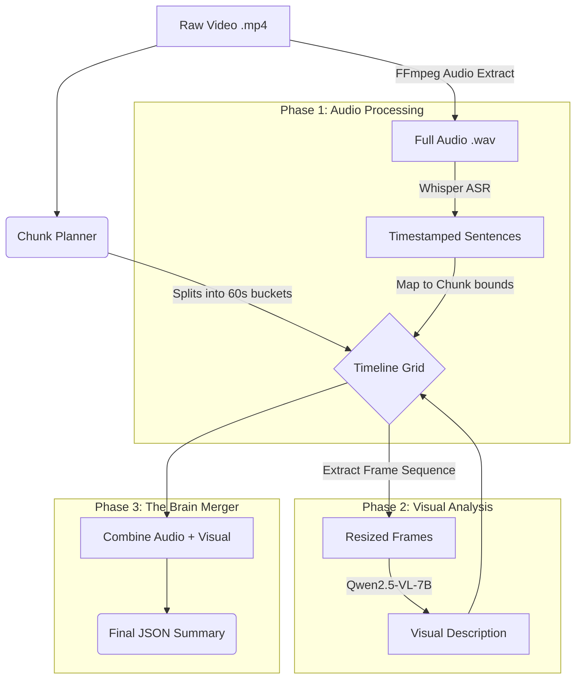

# Multimodal Video Note Maker Walkthrough

Welcome to your fully local, GPU-accelerated video to text pipeline! This document serves as a complete walkthrough of what we built, how it works, and how to use it.

## Hugging Face Token Requirement

This pipeline performs inference locally on your own device (GPU/CPU), but it still requires access to model files hosted on Hugging Face:
- `openai/whisper-small`
- `Qwen/Qwen2.5-VL-7B-Instruct`

So, a Hugging Face token is required for authentication/download reliability. The token does not move inference to the cloud. Model execution remains local.

Add token in `.env` at project root:

```env
HUGGING_FACE_HUB_TOKEN=hf_your_token_here
HF_TOKEN=hf_your_token_here
```

## Optional Diarization Note

`pyannote.audio` is not part of the default install in this project. This is intentional to avoid `torchcodec`/Windows DLL instability. The main video-to-notes pipeline works without diarization.

## 🌟 Key Accomplishments

We successfully transformed a cloud API-dependent scaffold into a **100% local, universally compatible multimodal pipeline**.
- **GPU Path**: Capable of running massive models on an 8GB RTX 4060 GPU without crashing using 4-bit `nf4` quantization.
- **CPU/iGPU Path**: Capable of dynamically detecting non-NVIDIA systems and gracefully falling back to highly optimized CPU-friendly engines (`faster-whisper` and `llama.cpp` GGUF models).

> [!TIP]
> **Dynamic Low-RAM Protection**
> The pipeline automatically monitors system RAM. If it detects a system with 8.5GB of RAM or less, it will safely downgrade the Vision model to a 3B parameter GGUF model (~2.2GB footprint) to completely prevent Out-Of-Memory crashes.

## 🏗️ System Architecture



### Phase 1: The Ears (Audio Transcription)
1. **FFmpeg Extraction**: The pipeline automatically finds FFmpeg on your system and extracts a lossless 16kHz `.wav` file.
2. **Audio Model Loading**: 
   - **GPU Mode**: Loads `openai/whisper-large-v3-turbo` in fast `float16`.
   - **CPU Mode**: Bypasses transformers entirely and uses `faster-whisper` (CTranslate2) for rapid CPU transcription.
3. **Execution**: It translates the audio (either in one big batch or via smaller chunks for the progress bar).
4. **Unloading**: The audio model is aggressively unloaded and the hardware caches are wiped.

### Phase 2: The Eyes (Visual Analysis)
1. **Model Loading**: 
   - **GPU Mode**: Loads `Qwen2.5-VL-7B-Instruct` using 4-bit (`nf4`) quantization via `bitsandbytes`.
   - **CPU Mode**: Skips `bitsandbytes` (which breaks on CPUs), downloads a `.gguf` file, and uses `llama-cpp-python` to process frames directly in system RAM. It will intelligently choose a `7B` or `3B` model based on your system's total RAM.
2. **Frame Sampling**: For every 60-second chunk, we dynamically sample exactly 4 evenly spaced screenshots.
3. **Resizing**: Each frame is shrunk to `384x384` pixels to fit into VRAM or system RAM safely.
4. **Description Generation**: The Vision model analyzes the sequence of frames and generates a highly descriptive summary of the action on screen.

> [!WARNING]
> **Estimated CPU Time Tradeoffs**
> If the pipeline falls back to CPU logic, expect audio transcription to take **2x - 3x longer**, and visual analysis to take significantly longer (e.g., 30-60 seconds per chunk instead of 5 seconds). The total pipeline will be roughly **5x to 10x slower** on an Intel laptop compared to an RTX 4060 GPU, but the output quality will be identical.

### Phase 3: The Brain (The Merger)
The orchestrator takes the spoken text and visual descriptions and merges them side-by-side perfectly synchronized to their strict 60-second time grids.

> [!WARNING]
> Because Whisper and Qwen-VL run sequentially, they do not inherently share context. If someone points to a screen and says "Look at this," the transcript will capture the words, and the vision model will capture the pointing action, but they are not synthesized by a secondary LLM logic yet.

## 🚀 How to Run

### Single Video Execution
```powershell
python -m src.video_to_text.cli --video "datasets/Rebuilding the Digital Content Ecosystem.mp4"
```

### Batch Directory Execution
To process every video sitting in the `datasets/` folder sequentially:
```powershell
Get-ChildItem -Path "datasets" -Filter "*.mp4" | ForEach-Object { python -m src.video_to_text.cli --video $_.FullName }
```

## ⚙️ Configuration
Open `src/video_to_text/config/settings.py` to tweak the pipeline:
* `visible_audio_progress`: Set to `True` to see an iterative progress bar during Phase 1 (slower), or `False` to use Whisper's internal batched pipeline (faster).
* `chunk_seconds`: Change the boundaries of the grid (default: 60 seconds).
* `max_frames_per_chunk`: Increase if you have more VRAM, decrease if you hit OOMs.

## Improved Output JSON Schema

The pipeline now emits a structured JSON designed for educational reasoning and safer downstream automation.

### Per Segment (`transcript_segments[]`)
- `start_seconds`, `end_seconds`, `text`, `speaker`
- `confidence`: heuristic trust score in `[0.0, 1.0]`
- `low_trust`: whether the segment is considered noisy
- `risk`: `low`, `medium`, or `high`

### Per Chunk
- `cleaned_transcript`: normalized transcript after repetition/overlap cleanup
- `trusted_transcript`: filtered transcript that excludes low-trust lines
- `cleanup_flags`: records what cleanup operations were applied
- `hallucination_risk`: chunk-level ASR noise risk
- `semantic_tags`: pedagogical role labels (`definition`, `formula`, `example`, `intuition`, `quiz`, `transition`)
- `concept_transitions`: concept shift markers (example: `logistic regression->softmax regression:generalization`)
- `merged_notes`: final multimodal note (trusted transcript + visual grounding)

### Why this matters
- Reduces repeated ASR corruption propagation into summaries.
- Makes chunks machine-actionable for RAG, tutoring, flashcards, and concept maps.
- Preserves instructional flow as concept transitions, not just raw timeline text.

