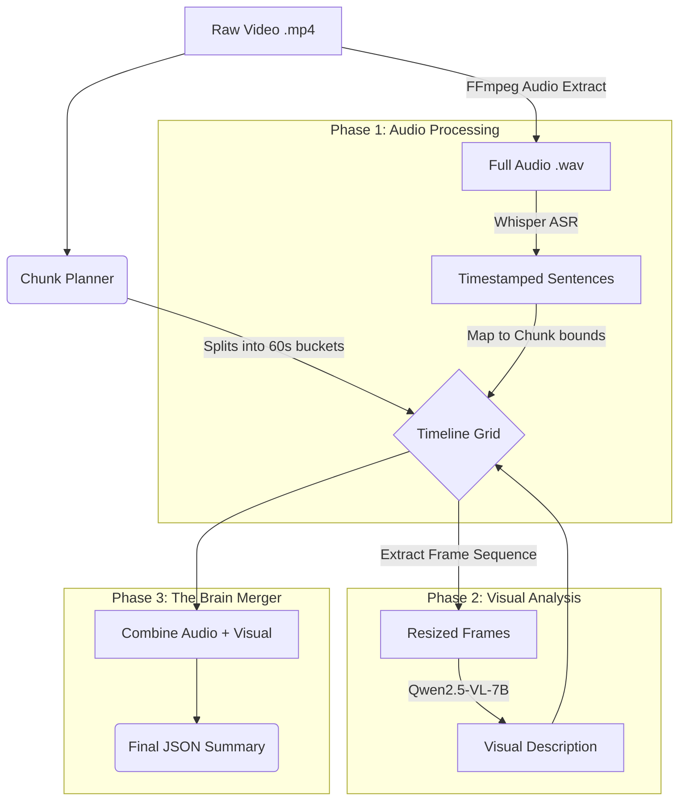

# Multimodal Video Note Maker Walkthrough

Welcome to your fully local, GPU-accelerated video to text pipeline! This document serves as a complete walkthrough of what we built, how it works, and how to use it.

## Hugging Face Token Requirement

This pipeline performs inference locally on your own device (GPU/CPU), but it still requires access to model files hosted on Hugging Face:
- `openai/whisper-small`
- `Qwen/Qwen2.5-VL-7B-Instruct`

So, a Hugging Face token is required for authentication/download reliability. The token does not move inference to the cloud. Model execution remains local.

Add token in `.env` at project root:

```env
HUGGING_FACE_HUB_TOKEN=hf_your_token_here
HF_TOKEN=hf_your_token_here
```

## 🌟 Key Accomplishments

We successfully transformed a cloud API-dependent scaffold into a **100% local, VRAM-efficient multimodal pipeline** capable of running on an 8GB RTX 4060 GPU without crashing.

> [!TIP]
> **VRAM Optimization**
> We specifically engineered a **Sequential Grid Architecture** that allows massive models to share a single GPU by taking turns, aggressively resizing frames, and clearing memory caches between execution phases.

## 🏗️ System Architecture



### Phase 1: The Ears (Audio Transcription)
1. **FFmpeg Extraction**: The pipeline automatically finds FFmpeg on your system and extracts a lossless 16kHz `.wav` file.
2. **Whisper ASR**: We load `openai/whisper-small` into the GPU. Depending on your configuration in `settings.py`, it either transcribes the entire audio file in a fast, highly-optimized batch, or it iteratively slices the audio into 60-second chunks using FFmpeg to provide a beautiful `tqdm` progress bar.
3. **Unloading**: Whisper is aggressively unloaded and the GPU is cleared.

### Phase 2: The Eyes (Visual Analysis)
1. **Model Loading**: We load `Qwen2.5-VL-7B-Instruct` using 4-bit (`nf4`) quantization.
2. **Frame Sampling**: For every 60-second chunk, we dynamically sample exactly 4 evenly spaced screenshots.
3. **Resizing**: Each frame is shrunk to `384x384` pixels to fit all 4 frames perfectly into your remaining VRAM.
4. **Description Generation**: Qwen-VL analyzes the sequence of frames and describes the ongoing action. If it encounters an unexpected memory spike, it automatically catches the crash and falls back to analyzing a single frame instead of dying.

### Phase 3: The Brain (The Merger)
The orchestrator takes the spoken text and visual descriptions and merges them side-by-side perfectly synchronized to their strict 60-second time grids.

> [!WARNING]
> Because Whisper and Qwen-VL run sequentially, they do not inherently share context. If someone points to a screen and says "Look at this," the transcript will capture the words, and the vision model will capture the pointing action, but they are not synthesized by a secondary LLM logic yet.

## 🚀 How to Run

### Single Video Execution
```powershell
python -m src.video_to_text.cli --video "datasets/Rebuilding the Digital Content Ecosystem.mp4"
```

### Batch Directory Execution
To process every video sitting in the `datasets/` folder sequentially:
```powershell
Get-ChildItem -Path "datasets" -Filter "*.mp4" | ForEach-Object { python -m src.video_to_text.cli --video $_.FullName }
```

## ⚙️ Configuration
Open `src/video_to_text/config/settings.py` to tweak the pipeline:
* `visible_audio_progress`: Set to `True` to see an iterative progress bar during Phase 1 (slower), or `False` to use Whisper's internal batched pipeline (faster).
* `chunk_seconds`: Change the boundaries of the grid (default: 60 seconds).
* `max_frames_per_chunk`: Increase if you have more VRAM, decrease if you hit OOMs.
